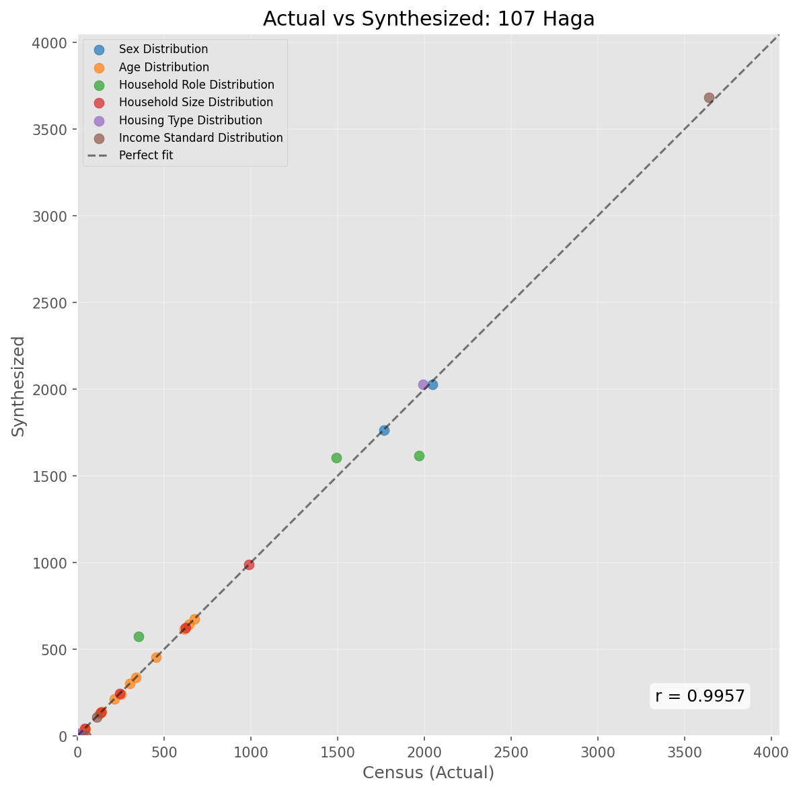
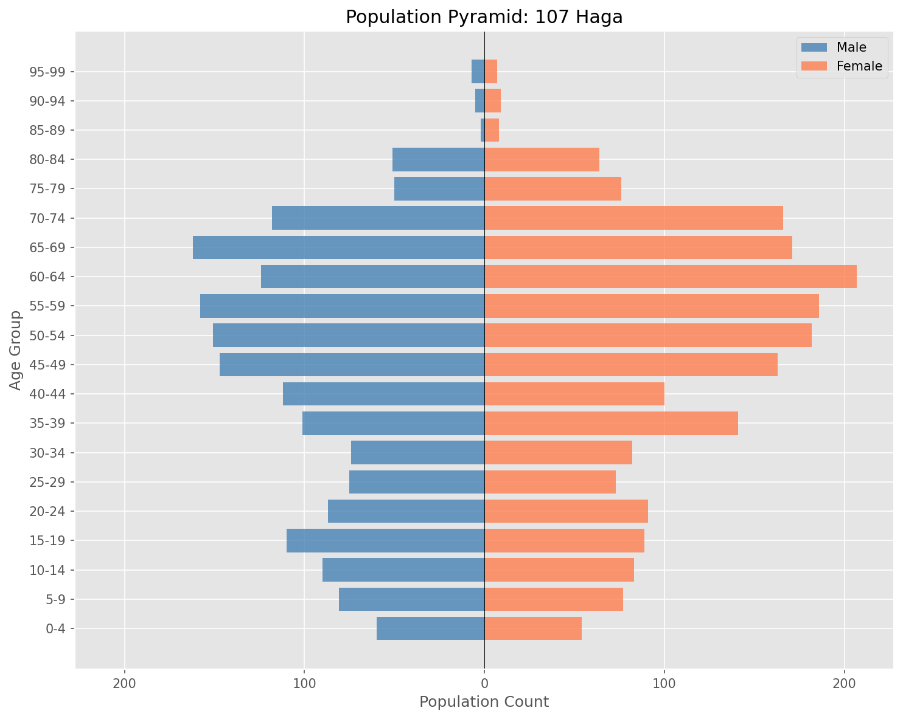
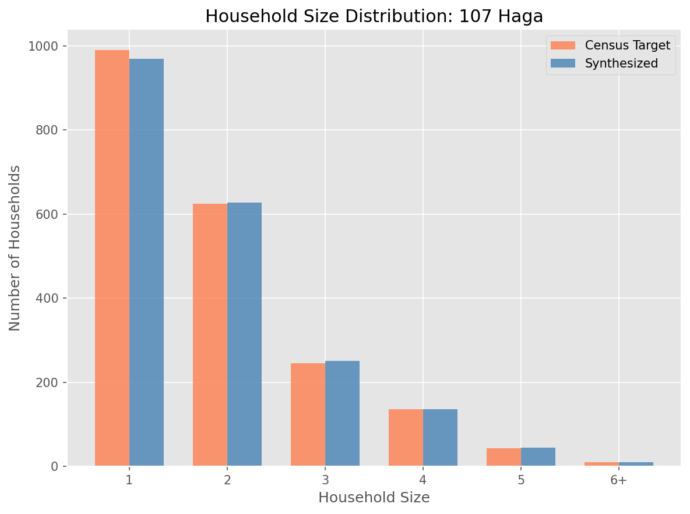
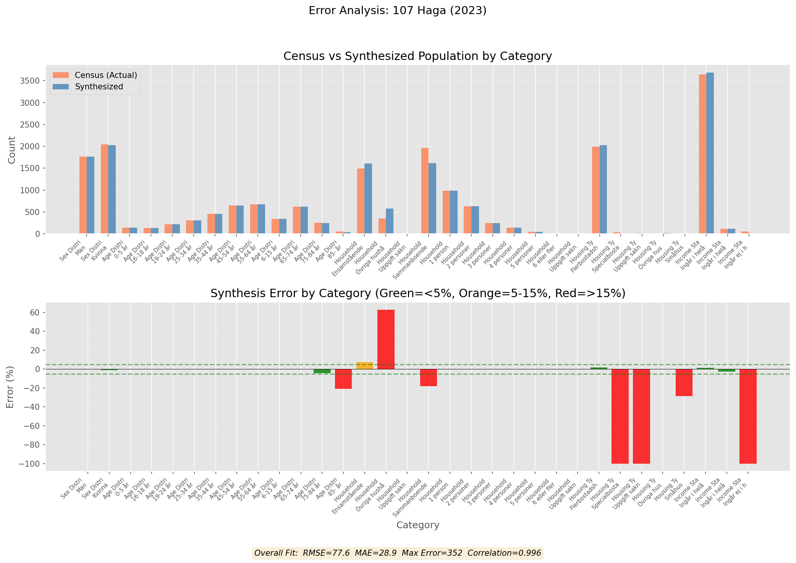
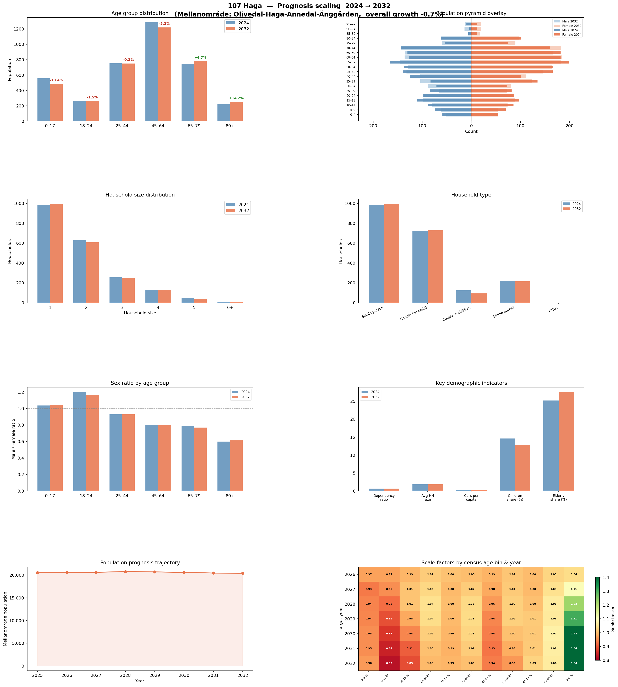

# GbgSynth - Synthetic Population Generator for Gothenburg


[](https://doi.org/10.1016/j.dib.2024.110945)

A modular Python library for procedurally generating synthetic populations using the Gothenburg PxWeb API.

## Features

- **Simple API**: One-liner synthesis with `city.synthesize("Haga")`
- **Bundled Data**: 96 neighbourhood names, codes, and boundaries included (no API calls to browse)
- **Top-Down Synthesis**: Constrained household-first approach for accurate population generation
- **Agent-Based Modeling**: Individual agents with demographics and socioeconomic attributes
- **Household Synthesis**: Relationship modeling with biological and age constraints
- **Housing Type Integration**: Links households to building types (Småhus, Flerbostadshus)
- **Dwelling Allocation**: Assigns households to dwellings with building footprint georeferencing
- **Car Ownership**: Propensity-based vehicle assignment from census data
- **Prognosis Scaling**: Project populations to future years (2025–2032) using official prognosis data
- **Validation Suite**: Comprehensive marginal comparison and out-of-sample validation

## Installation

```bash
pip install -e .
```

## Quick Start

```python
from gbgsynth import GbgSynth

# One-liner synthesis
city = GbgSynth(year=2023)
haga = city.synthesize("Haga")  # Generates population immediately
haga.save("output/")  # Saves individuals.csv, households.csv, dwellings.csv

# Access data
print(f"Population: {len(haga.individuals)}")
print(f"Households: {len(haga.households)}")
print(f"Dwellings: {len(haga.dwellings)}")

# Get as DataFrames
df = haga.individuals_df
print(df['age'].describe())
```

## API Reference

### Browse Areas (No API Call Needed)

```python
from gbgsynth import GbgSynth

# List all neighbourhood names
GbgSynth.list_areas()
# ['Kungsladugård', 'Sanna', 'Majorna', 'Haga', ...]

# Look up area code
GbgSynth.get_area_code("Haga")  # Returns '107'

# Get all areas as dict
city = GbgSynth()
city.get_all_areas()  # {'107': '107 Haga', ...}
```

### Generate Population

```python
city = GbgSynth(year=2023)

# Method 1: One-liner (generates immediately)
area = city.synthesize("Haga")

# Method 2: Step-by-step
area = city.get_area("Haga")  # or "107" or "107 Haga"
area.generate()  # Top-down constrained synthesis
area.save("output/")

# Method 3: Generate without dwelling allocation
area.generate(allocate_dwellings=False)
```

### Save Results

```python
# Simple: saves to current directory
area.save()  # Creates 107_Haga_individuals.csv and 107_Haga_households.csv

# Custom directory and prefix
area.save("output/", prefix="haga_2024")

# Or save individually
area.save_to_csv("individuals.csv")
area.save_households_to_csv("households.csv")

# Get as DataFrames (no file I/O)
dfs = area.to_dataframes()
dfs['individuals'].head()
dfs['households'].describe()
```

### Geographic Boundaries

```python
# Get boundary for one area (requires geopandas)
boundary = GbgSynth.get_boundary("107")

# Get all boundaries as GeoDataFrame
gdf = GbgSynth.get_all_boundaries()
gdf.plot()  # Quick visualization
```

## Batch Processing

```python
from gbgsynth import GbgSynth

city = GbgSynth(year=2023)

# Process all areas
for name in GbgSynth.list_areas():
    try:
        area = city.synthesize(name)
        area.save("output/")
    except Exception as e:
        print(f"Failed {name}: {e}")
```

## Architecture

### Core Components

1. **PxWebClient** (`api_client.py`): Handles all API communication with caching
2. **Config** (`config/`): JSON mappings and table definitions
3. **Models** (`models.py`): Agent, Household, and Dwelling classes
4. **Synthesizer** (`synthesizer.py`): Population generation algorithms
5. **GbgArea** (`area.py`): Area-specific synthesis orchestrator
6. **Validation** (`validation.py`): Out-of-sample validation framework

### Synthesis Method

The library uses a **Top-Down Constrained** approach:

```python
area.generate()
```

**How it works:**

GbgSynth uses a **top-down constrained matching** algorithm that proceeds in three main phases:

---

**Phase 1: Create Household Containers**

The algorithm creates exact household "containers" based on census data:

1. Parse household size distribution from census table `31_HHStorlHustyp_PRI.px`
2. Create one container per household (e.g., 500 1-person, 300 2-person, etc.)
3. Sample housing type (villa, apartment, etc.) for each container using observed proportions
4. Assign car ownership based on house type and household size from table `10_Bilar_PRI.px`
5. Sort containers by size descending (largest households filled first)

---

**Phase 2: Generate Individual Pool**

Individuals are generated from census marginals with assigned household roles:

1. Load population data from table `63_FolkmHHtypPRI.px` with age/sex/role counts
2. If detailed position data is available (`HHPositionBarnLnk_PRI.px`), use it for exact role counts
3. For each demographic cell (age × sex × role), create the exact number of synthetic agents
4. Assign roles: `single`, `cohabiting`, `single_parent`, `child`, or `other`
5. Categorize the pool into role-based queues and shuffle for randomization

---

**Phase 3: Constrained Assignment**

Individuals are placed into households following biological and structural constraints:

**Step 3a – Form Couples:**
- For each multi-person household with ≥2 capacity:
  - Find compatible male-female pair from `cohabiting` pool
  - Enforce age constraint: `|age_male - age_female| ≤ 15` years
  - Assign both to household, decrement capacity

**Step 3b – Place Single Parents:**
- Place each `single_parent` in an **empty** multi-person household
- Ensures single-parent families get exactly one adult before children arrive

**Step 3c – Assign Children:**
- Sort children by age (youngest first for biological plausibility)
- Assign each child to a household that:
  - Has at least one adult already present
  - Has remaining capacity
  - Contains a parent ≥18 years older than the child

**Step 3d – Place "Other" Roles:**
- Assign roommates, extended family, etc. to remaining multi-person capacity

**Step 3e – Fill Singles:**
- Match `single` adults to 1-person household containers

**Step 3f – Handle Overflow:**
- Any unplaced individuals are redistributed:
  - Adults → remaining multi-person capacity
  - Unplaceable → create new single-person households
- Validate that no household contains only children (auto-fix by adding adult)

---

**Phase 4: Attribute Assignment**

After placement, socioeconomic attributes are assigned:

1. **Income**: Sample from decile distribution (`HuvudInk_PRI.px`) per household
2. **Car ownership**: Already assigned in Phase 1 based on house type and size
3. **Housing type**: Already assigned from census proportions

---

**Phase 5: Dwelling Allocation & Building Linking**

Households are spatially located using building footprints:

1. Load building footprints from GeoPackage (DTCC-generated or custom)
2. Match household housing type to building type (villa → small residential, etc.)
3. Assign households to dwellings within compatible buildings
4. Link each household to a specific `building_id` and `dwelling_id`
5. Export includes geometry for GIS integration

---

## Validation & Model Performance

GbgSynth has been validated across all 96 neighbourhoods of Gothenburg. The synthesis achieves high fidelity to census marginals while maintaining realistic household compositions.

### Overall Performance (96 Areas)

| Metric | Value | Description |
|--------|-------|-------------|
| **Median Correlation** | 0.993 | Pearson correlation between synthesized and census counts |
| **Mean MAPE** | 8.2% | Mean Absolute Percentage Error across all categories |
| **Quality Grade A** | 63 areas (66%) | Correlation ≥ 0.99 |
| **Quality Grade B** | 12 areas (12%) | Correlation 0.98–0.99 |
| **Quality Grade C** | 11 areas (11%) | Correlation 0.97–0.98 |
| **Quality Grade D/F** | 10 areas (10%) | Correlation < 0.97 |

### Validation by Dimension

| Dimension | Mean Error | Max Error | Notes |
|-----------|------------|-----------|-------|
| **Sex** | 0.3% | 3.8% | Near-exact match |
| **Age** | 0.8% | 33% | Higher error in small cells |
| **Household Role** | 25% | 100% | Challenging for some areas |
| **Household Size** | 4.0% | 40% | Good overall fit |
| **Housing Type** | 6.5% | 80% | Affected by rare categories |
| **Income Decile** | 38% | 100% | Privacy suppression limits accuracy |

### Example Validation Plots (Haga, Area 107)

<p align="center">
  
  
</p>

<p align="center">
  
  
</p>

### Running Validation

```python
# Compare synthesized population to census marginals
comparison = area.compare_to_marginals()
print(f"Correlation: {comparison['overall']['correlation']:.4f}")
print(f"MAPE: {comparison['overall']['mape']:.1f}%")

# Full validation report
area.log_statistics()

# Out-of-sample validation
from gbgsynth.validation import Validator
validator = Validator(area)
report = validator.run_all_validations()
```

### Known Limitations

1. **Household Role Assignment**: Areas like Bergsjön, Hjällbo show elevated errors in household role assignment. The Swedish census categories don't fully capture multi-generational or non-traditional household structures.

2. **Privacy Suppression ("Sekretess")**: Small cells in census data are suppressed for privacy. This affects areas with small populations (< 1,000 residents) and rare demographic combinations, leading to mismatches that cannot be resolved.

3. **Income Distribution**: Income data is heavily suppressed in the source tables. Current implementation samples uniformly from deciles, which may not reflect true income inequality.

4. **Housing Type Matching**: Rare housing categories like "Specialbostad" (special housing) and "Uppgift saknas" (data missing) are underrepresented in synthesized output.

5. **Very Small Areas**: Areas with < 100 residents (e.g., Högsbo with 38 people, Arendal with 40 people) have inherently high percentage errors due to small denominators.

---

### Constraints

- **Partner Age Difference**: Maximum 10 years
- **Biological Parent Age**: Minimum 18 years older than children
- **Housing Compatibility**: Household size must match building capacity

## Prognosis Scaling

GbgSynth can project neighbourhood populations to future years (2025–2032) using official prognosis data from the Gothenburg Statistics API. The scaling uses per-single-year population prognosis data (ages 0–99) at the mellanområde level, computing precise scale factors for each census age bin.

### Usage

```python
from gbgsynth import GbgSynth

city = GbgSynth(year=2024)

# Synthesize with future year scaling
haga = city.synthesize("Haga", target_year=2032)
print(f"Projected population: {len(haga.individuals)}")

# Or scale an existing area
area = city.get_area("Haga")
area.generate()
area.scale_to_year(2032)
area.generate()  # Re-synthesize with scaled marginals
```

### Demographic Dashboard

The 8-panel dashboard below shows the demographic impact of scaling Haga (area 107) from 2024 to 2032. The prognosis projects a **−2.1% population decline** (3826 → 3744), with notable shifts in age structure: children decrease from 850 to 771 while singles increase from 1007 to 1025.

<p align="center">
  
</p>

Panels: **(a)** Age group scale factors, **(b)** Population pyramids (base vs. projected), **(c)** Household size distribution, **(d)** Household type composition, **(e)** Sex ratio changes, **(f)** Key demographic indicators, **(g)** Population trajectory 2025–2032, **(h)** Age-bin × year heatmap of scale factors.

### How It Works

1. **Prognosis data**: Fetched from `14_PrognosMO21.px` at the mellanområde (intermediate area) level, providing population counts for every single year of age (0–99) for years 2025–2032
2. **Geographic mapping**: Each primärområde is mapped to its parent mellanområde via `pri_to_mel.json` (96 pri → 36 mel)
3. **Scale factor computation**: For each census age bin (e.g., "6-15 år"), the prognosis counts for ages 6–15 are summed in both the base and target years, and the ratio `target_sum / base_sum` gives the scale factor
4. **Marginal scaling**: Census marginals (population, household position) are multiplied by the corresponding age-bin factor, then re-synthesized

---

## Data Tables Used

| Table ID | Description | Variables |
|----------|-------------|-----------|
| `63_FolkmHHtypPRI.px` | Population by household type | Area, Age, Sex, HH Role |
| `31_HHStorlHustyp_PRI.px` | Household size by building type | Area, Size, House Type |
| `10_Bilar_PRI.px` | Car ownership | Area, Year |
| `HuvudInk_PRI.px` | Income distribution | Area, Decile |

## Bundled Data

GbgSynth includes pre-bundled data files so you can start synthesizing immediately without manual downloads:

| File | Description | Source |
|------|-------------|--------|
| `areas.json` | 96 neighbourhood codes, names, and identifiers | Generated from primary area shapefile |
| `pri_shp/` | Primary area shapefile (boundaries) | [Gothenburg Open Data](https://goteborg.se/) |
| `footprints/` | Per-neighbourhood building heights (GeoPackage) | Generated using [DTCC](https://dtcc.chalmers.se/) from Lantmäteriet pointcloud data |

### Automatic Data Setup

All bundled data is generated automatically using `gbgsynth.data_utils`. If files are missing, the library will attempt to download and generate them on first use:

```python
from gbgsynth.data_utils import ensure_data_available

# Downloads shapefile, generates areas.json, downloads footprints, computes heights
ensure_data_available()
```

### Manual Regeneration

To regenerate specific data files:

```python
from gbgsynth.data_utils import (
    download_pri_shapefile,      # Download primary area boundaries
    generate_areas_json,         # Generate area code/name mapping
    download_footprints,         # Download building footprints via DTCC
    generate_neighbourhood_heights  # Compute building heights from pointcloud
)

# Force regeneration (even if files exist)
download_pri_shapefile(force=True)
generate_areas_json(force=True)
generate_neighbourhood_heights(force=True)  # Requires dtcc package
```

### Data Sources

1. **Primary Area Shapefile**: Downloaded from Gothenburg city's open data portal. Contains the 96 "primärområden" (primary statistical areas) with their boundaries.

2. **Building Footprints & Heights**: Generated using the [DTCC Platform](https://dtcc.chalmers.se/) which downloads building footprints from Lantmäteriet and computes heights from national LiDAR pointcloud data.

3. **Census Marginals**: Fetched live from the [Gothenburg Statistics PxWeb API](https://statistikdatabas.goteborg.se/) during synthesis.

## Privacy Handling

The library uses Python's `logging` module to track "Sekretess" (privacy suppression) in source data where totals don't match due to small cell sizes.

```python
import logging
logging.basicConfig(level=logging.INFO)

# Will log warnings when data gaps are detected
area.generate()
```

## Contributing

Contributions welcome! Key areas for improvement:

- Additional validation constraints
- Spatial allocation algorithms
- Including future year prognosis
- Connecting to SweLoadSim

## License

MIT License

## Citation

If you use this library in research, please cite:

> Somanath, S., Thuvander, L., & Hollberg, A. (2024). An activity-based synthetic population of Gothenburg, Sweden: Dataset of residents in neighbourhoods. *Data in Brief*, 56, 110945. https://doi.org/10.1016/j.dib.2024.110945

**BibTeX:**
```bibtex
@article{somanath2024activity,
  title={An activity-based synthetic population of Gothenburg, Sweden: Dataset of residents in neighbourhoods},
  author={Somanath, Sanjay and Thuvander, Liane and Hollberg, Alexander},
  journal={Data in Brief},
  volume={56},
  pages={110945},
  year={2024},
  publisher={Elsevier},
  doi={10.1016/j.dib.2024.110945}
}
```

This library is an extension of the population synthesis module described in the paper.
